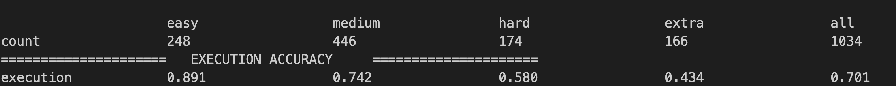

# chatgpt-sql

The prediction results of ChatGPT on various datasets of Text-to-SQL.

For the specific evaluation methods and results, please refer to this paper "A comprehensive evaluation of ChatGPT's zero-shot Text-to-SQL capability" (https://arxiv.org/pdf/2303.13547.pdf). 


## Test example on spider dataset

### generate data 
```python
python generate_txt.py
```

### generate evaluation result (unzip the database.zip first)
```python
python evaluation.py --gold gold_example.txt --pred pred_example.txt --etype exec --db spider/database --table spider/tables.json
```

The result should be following:


